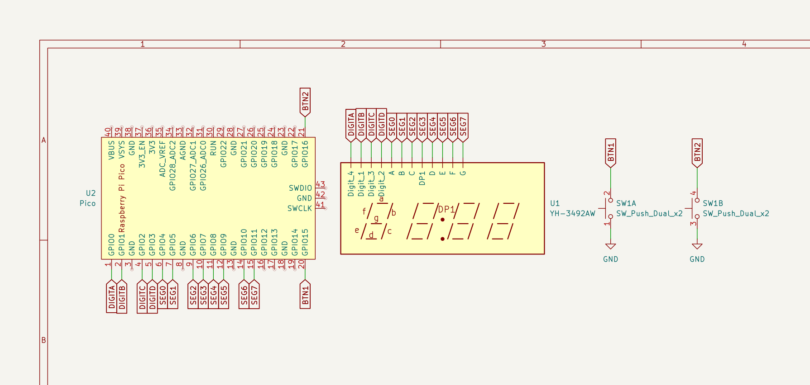

# YH-3492AW
This repo contains all the pinouts for this display that came originally from a Midea EGXEELC-01-K microwave driver board. Aditionally it comes with some sample code written on the pico-sdk for the pi pico, and the symbol and footprint used in the schematics.

* main.c: Simple counter for testing all digits at once
* testingbuttons.c: Program to go through each segment and each digit using the 2 buttons included in the schematics

To compile simply run: **sh compile.sh**

This project was created using my [PicoSchetchCreator](https://github.com/pedrohcs8/PicoSchetchCreator)

